# Plunk 产品需求文档（PRD）

版本号：V1.0.0

| 版本 | 时间 | 修订人 | 备注 |
|------|------|--------|------|
| V1.0.0 | 2026/04/28 | PM | 创建初始版本 |

---

## 一、概述（为什么做）

### 1.1 产品概述及目标

#### 1.1.1 背景介绍

在快节奏的现代生活中，越来越多人渴望一种轻量、治愈的方式来记录生活。现有的日记应用大多功能复杂、界面冰冷，或过度依赖AI生成内容，缺少"人"的温度。

用户痛点：
- 传统日记App界面复杂，记录门槛高
- 缺乏情感连接，难以坚持记录
- AI产品泛滥，缺少有温度、有手绘感的体验
- 记录缺乏视觉反馈，难以感知成长

市场机会：
- 治愈系、慢生活产品需求增长
- 用户愿意为有情感价值的产品付费（募捐/打赏）
- 独立开发者友好，Unity+Firebase技术栈成熟

#### 1.1.2 产品概述

Plunk 是一款以"树的生长"为视觉载体的轻量化记录工具。用户每次记录，树就会长大一点，时间不再是线性的流逝，而是一圈一圈的丰盈。整体风格简约、清新、治愈，采用手绘感UI设计，让用户在记录中感受成长与陪伴。

#### 1.1.3 产品目标

**业务目标**

| 目标 | 指标 | 目标值 | 达成时间 |
|------|------|--------|----------|
| 完成开发上架 | App Store 审核通过 | 1款 | 2026/06 |
| 用户获取 | 累计注册用户 | 1000+ | 上线后3个月 |
| 用户留存 | 次日留存率 | > 30% | 上线后1个月 |
| 用户活跃 | 平均每人每周记录次数 | > 3次 | 上线后2个月 |

**用户目标**

| 目标用户 | 用户目标 | 衡量指标 |
|---------|---------|---------|
| 记录者 | 用轻松的方式记录生活 | 单次记录时长 < 10分钟 |
| 治愈寻求者 | 获得视觉上的成长反馈 | 树成长动画触发率 100% |
| 回顾者 | 以有趣的方式回顾历史 | 年轮页访问率 > 40% |

#### 1.1.4 目标用户

| 角色 | 描述 | 核心诉求 |
|------|------|----------|
| 记录者 | 有记录习惯或想培养记录习惯的用户 | 简单、快速、有仪式感 |
| 治愈寻求者 | 生活压力大，需要情感寄托的用户 | 治愈、陪伴、成长感 |
| 创意爱好者 | 喜欢有设计感、独特产品的用户 | 视觉精美、与众不同 |

### 1.2 名词说明

| 名词 | 说明 |
|------|------|
| 树 | 用户首页展示的动态视觉元素，随记录成长 |
| 年轮 | 历史记录的可视化展示形式，圆形时间轴 |
| 天气 | 根据用户心情变化的首页树的场景视觉氛围效果（晴天、下雨、飘雪等） |
| 树卡片 | 记录一定数量后解锁，展示树的种类和象征意涵 |每个用户只有一棵树  
| 心情emoji | 记录时选择的心情图标，用于分类和天气系统 |

### 1.3 角色及权限

| 角色 | 权限范围 | 数据范围 |
|------|---------|----------|
| 未注册用户 | 查看欢迎页、注册页 | 无 |
| 已注册用户 | 全部功能（记录、回顾、设置） | 仅本人数据 |

### 1.4 文档阅读对象

| 对象 | 关注内容 |
|------|----------|
| 开发者（本人） | 功能需求、技术方案、数据字典、接口定义 |
| UI/动效设计 | 界面交互、动效规范、视觉风格 |
| 测试 | 异常流程、验收标准 |
| 未来协作者 | 整体产品逻辑、扩展方向 |

---

## 二、产品描述（做什么）

### 2.1 产品需求描述

**做什么：**
- 核心功能：记录（文字/语音/图片）+ 视觉反馈（树成长）+ 历史回顾（年轮）
- 差异化：手绘感UI + 树的成长动效 + 年轮回顾形态
- 平台：iOS App Store 优先，后续考虑 Android

**不做什么（V1.0版本）：**
- 社交功能（评论、点赞、关注）
- 数据云同步（换设备需重新注册）
- 多账号切换
- 付费功能（仅募捐入口）

**约束条件：**
- 单人开发，技术栈选择需考虑学习曲线
- 6月前上架，约60天开发周期
- Unity + Firebase 技术栈确定
- 图片存储成本需控制（Firebase Storage 免费额度）

### 2.2 产品整体流程

#### 2.2.1 主流程

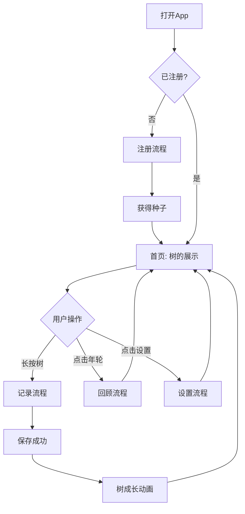

#### 2.2.2 注册流程

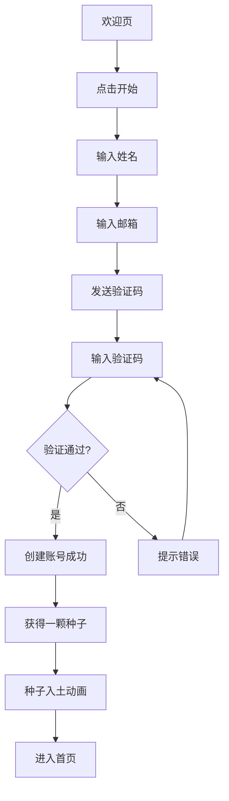

#### 2.2.3 记录流程

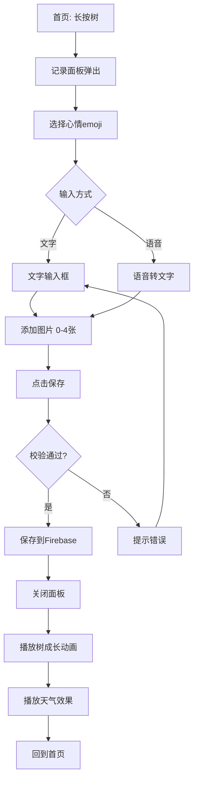

#### 2.2.4 数据流图（DFD）

```mermaid
flowchart LR
    subgraph 外部实体
        A[用户]
    end

    subgraph 系统边界
        B[首页/树展示]
        C[记录模块]
        D[回顾模块]
        E[账号模块]
    end

    subgraph 数据存储
        F[(Firebase Auth)]
        G[(Firestore)]
        H[(Storage)]
    end

    A -->|注册信息| E
    E -->|认证请求| F
    F -->|认证结果| E

    A -->|记录内容| C
    C -->|存储文字| G
    C -->|存储图片| H
    G -->|记录数据| B
    G -->|历史记录| D

    B -->|树状态| A
    D -->|年轮展示| A
```

#### 2.2.5 状态转换图（STD）

**树的状态转换：**

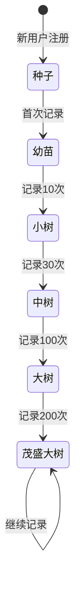

**记录的状态转换：**

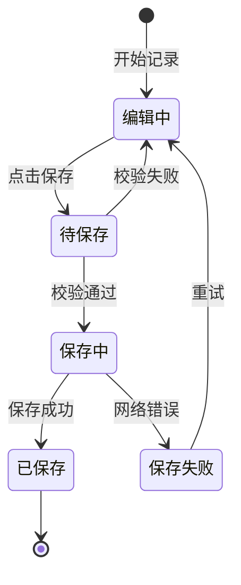

### 2.3 全局说明

#### 2.3.1 全局异常处理

| 异常场景 | 处理方式 | 提示文案 |
|---------|---------|--------| 网络异常 | 显示离线提示，本地缓存记录，网络恢复后同步 | "Network error. Record saved locally." |
| 服务超时 | 显示提示，支持重试 | "Server timeout. Please try again later." |
| Firebase不可用 | 显示提示，使用本地存储 | "Service unavailable. Record saved locally." |
| 存储空间不足 | 显示提示，建议清理 | "Insufficient storage. Please delete some images." |
| 图片过大 | 自动压缩后上传 | - |
| 语音识别失败 | 提示重试或改用文字输入 | "Voice recognition failed. Try again or type." |
| 验证码过期 | 提示重新发送 | "Verification code expired. Please get a new one." |
| 验证码错误 | 提示重新输入 | "Incorrect verification code. Please try again." |
| 邮箱已注册 | 提示直接登录 | "Email already registered. Please log in." |

#### 2.3.2 列表规则

| 规则项 | 说明 |
|--------|------|
| 分页 | 年轮回顾默认显示所有记录，支持按分类筛选 |
| 排序 | 默认按时间倒序（最新在前） |
| 搜索 | 支持关键词搜索记录内容 |
| 空数据 | 显示插画 + "No records yet. Long press the tree to start." |
| 图片加载 | 优先加载缩略图，点击查看原图 |

#### 2.3.3 全局交互

| 场景 | 交互方式 |
|------|----------|
| 操作成功 | 轻量Toast提示，1.5秒后自动消失 |
| 操作失败 | 弹窗提示错误详情，支持重试 |
| 加载中 | 显示手绘风loading动画（小树摇摆） |
| 长按触发 | 震动反馈 + 视觉缩放效果 |
| 页面切换 | 淡入淡出动画，300ms |
| 删除记录 | 二次确认弹窗 |
| 返回操作 | 左滑返回 / 点击返回按钮 |

#### 2.3.4 视觉风格规范

| 规范项 | 说明 |
|--------|------|
| 色彩 | 主色调：暖绿色（#EFE58E）、大地色（#676017）、背景色（#FBFAEE）|
| 字体 | 圆润、手写感字体，英文优先使用 Nunito 或 Quicksand 等无衬线圆角字体 |
| 插画 | 手绘水彩风格，线条不完美、有温度 |
| 动效 | 流畅、治愈，避免过于炫技，以"呼吸感"为主 |
| 图标 | 手绘线条风格，统一粗细和圆角 |
| 按钮 | 圆角矩形，带手绘边框效果 |

### 2.4 产品版本规划（里程碑）

| 版本 | 范围 | 计划时间 | 状态 |
|------|------|----------|------|
| V0.1 | 项目搭建、Unity环境、Firebase配置 | 2026/04 | 待开始 |
| V0.5 | 注册登录、树的基础展示 | 2026/05上旬 | 规划中 |
| V0.8 | 记录功能、树的成长动效 | 2026/05中旬 | 规划中 |
| V1.0 | 完整功能、测试通过、上架 | 2026/06 | 规划中 |
| V1.1 | Bug修复、性能优化 | 2026/06+ | 远期 |
| V2.0 | Android版本、数据同步、更多树种 | 2026/Q3+ | 远期 |

### 2.5 产品框架

```
Plunk App
├── 展示层（Unity UI）
│   ├── 欢迎模块
│   │   ├── 欢迎页
│   │   └── 注册页
│   ├── 首页模块
│   │   ├── 树的展示
│   │   ├── 天气效果
│   │   └── 记录入口
│   ├── 记录模块
│   │   ├── 心情选择
│   │   ├── 文字输入
│   │   ├── 语音输入
│   │   └── 图片选择
│   ├── 回顾模块
│   │   ├── 年轮展示
│   │   ├── 分类筛选
│   │   └── 记录详情
│   └── 设置模块
│       ├── 个人信息
│       ├── 通知设置
│       ├── 关于Plunk
│       └── 募捐入口
│
├── 逻辑层
│   ├── 用户管理服务
│   ├── 记录管理服务
│   ├── 树的状态管理
│   ├── 语音识别服务
│   └── 图片压缩服务
│
└── 数据层
    ├── Firebase Auth（认证）
    ├── Firestore（数据库）
    ├── Storage（图片存储）
    └── 本地缓存（离线支持）
```

### 2.6 功能清单

| 模块 | 功能 | 优先级 | 版本 | 说明 |
|------|------|--------|------|------|
| 账号 | 欢迎页 | P0 | V1.0 | 品牌展示，引导注册 |
| 账号 | 注册登录 | P0 | V1.0 | 姓名+邮箱+验证码 |
| 账号 | 账号管理 | P1 | V1.0 | 查看账号信息、退出登录 |
| 首页 | 树的展示 | P0 | V1.0 | 动态树造型，随成长变化 |
| 首页 | 天气效果 | P0 | V1.0 | 根据心情变化视觉氛围 |
| 首页 | 长按触发记录 | P0 | V1.0 | 震动反馈+视觉提示 |
| 记录 | 心情选择 | P0 | V1.0 | 选择emoji，影响天气 |
| 记录 | 文字输入 | P0 | V1.0 | 最多1000字 |
| 记录 | 语音输入 | P1 | V1.0 | 语音转文字，最长60秒 |
| 记录 | 图片上传 | P1 | V1.0 | 0-4张，每张≤5MB |
| 记录 | 保存记录 | P0 | V1.0 | 存储到Firebase |
| 成长 | 树成长动画 | P0 | V1.0 | 记录后播放成长动效 |
| 成长 | 树卡片解锁 | P2 | V1.0 | 达到里程碑展示树卡片 |
| 回顾 | 年轮展示 | P0 | V1.0 | 圆形时间轴，所有记录 |
| 回顾 | 分类筛选 | P1 | V1.0 | 心情/地点/社交/美食 |
| 回顾 | 记录详情 | P0 | V1.0 | 点击查看完整记录 |
| 回顾 | 删除记录 | P2 | V1.0 | 二次确认后删除 |
| 设置 | 个人信息 | P1 | V1.0 | 查看姓名、邮箱 |
| 设置 | 通知提醒 | P2 | V1.0 | 每日提醒开关 |
| 设置 | 关于Plunk | P2 | V1.0 | 产品介绍、版本号 |
| 设置 | 募捐支持 | P2 | V1.0 | 跳转募捐页面 |

---

## 三、功能需求（怎么做）

### 3.1 欢迎页

#### 3.1.1 描述
用户首次打开App看到的品牌展示页，传达产品理念，引导用户开始注册。

#### 3.1.2 用户故事
```
作为 新用户，我希望 第一眼就感受到Plunk的治愈风格，以便 建立对产品的好感和信任。
```

#### 3.1.3 前置条件

| 类型 | 条件 |
|------|------|
| 功能依赖 | App已安装并打开 |
| 数据依赖 | 无 |

#### 3.1.4 后置条件
- 用户点击"开始"，进入注册流程
- 系统检查本地是否有已登录状态，有则直接进入首页

#### 3.1.5 界面及交互

**页面布局：**
- 背景：手绘风天空渐变（淡黄）
- 中央：一棵小树的插画，微微摇摆的动画
- 下方：产品Slogan "YOU CAN BE A TREE"
- 底部："Start" 按钮（手绘风格圆角按钮）
- 右下角：版本号（小字灰色）

**控件说明：**

| 元素 | 类型 | 必填 | 默认值 | 校验规则 | 操作反馈 |
|------|------|------|--------|---------|---------|
| 开始按钮 | 按钮 | - | - | - | 点击后淡出当前页，淡入注册页 |

#### 3.1.6 业务流程

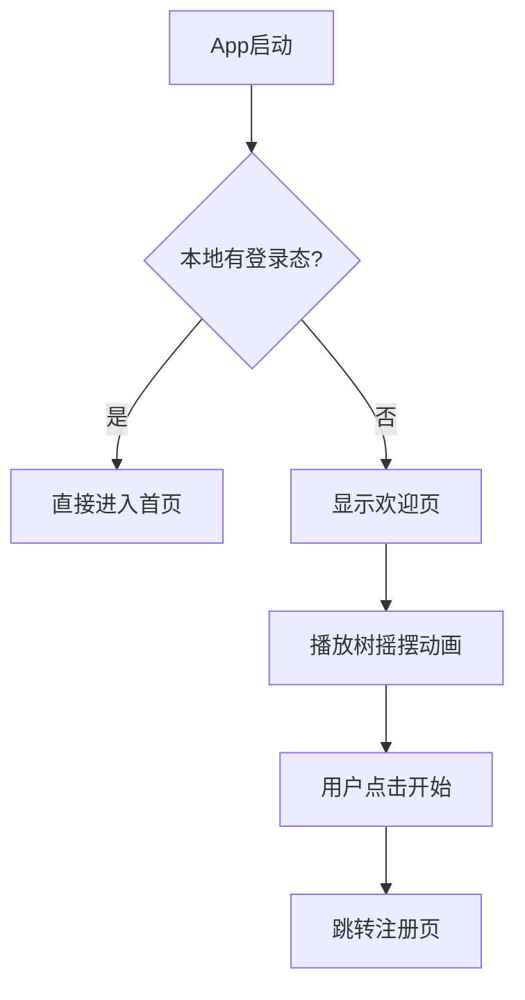

#### 3.1.7 异常/分支流程

| 场景 | 触发条件 | 处理方式 | 提示文案 |
|------|---------|---------|---------|
| App首次启动慢 | 资源加载耗时 | 显示loading动画 | - |

#### 3.1.8 数据字典
无

---

### 3.2 注册登录

#### 3.2.1 描述
用户通过姓名+邮箱+验证码完成注册，获得一颗种子开始Plunk之旅。

#### 3.2.2 用户故事
```
作为 新用户，我希望 用最简单的方式注册，以便 快速开始使用产品。
作为 用户，我希望 注册时有仪式感，以便 感受到产品的用心和温度。
```

#### 3.2.3 前置条件

| 类型 | 条件 |
|------|------|
| 功能依赖 | 从欢迎页点击"开始" |
| 数据依赖 | 无 |

#### 3.2.4 后置条件
- Firebase Auth 创建账号成功
- Firestore 创建用户数据（姓名、邮箱、创建时间、记录数=0）
- 本地保存登录态
- 进入首页，展示种子入土动画

#### 3.2.5 界面及交互

**页面布局：**
- 顶部：返回按钮（左上角）、页面标题"Start Your Journey"（居中）
- 中部：
  - 姓名输入框（占位符：What's your name?）
  - 邮箱输入框（占位符：Your email address）
  - 验证码输入框（占位符：Enter verification code）
  - 发送验证码按钮（在验证码输入框右侧，显示"Send Code"）
- 底部：注册按钮（手绘风格，圆角，显示"Start Planting"）
- 背景：延续欢迎页的手绘风格

**控件说明：**

| 元素 | 类型 | 必填 | 默认值 | 校验规则 | 操作反馈 |
|------|------|------|--------|---------|---------|
| 姓名输入框 | 文本输入框 | 是 | 空 | 2-20字符，不允许特殊符号 | 超长/非法时提示 |
| 邮箱输入框 | 文本输入框 | 是 | 空 | 有效邮箱格式 | 格式错误时提示 |
| 验证码输入框 | 文本输入框 | 是 | 空 | 6位数字 | 长度不足时提示 |
| 发送验证码按钮 | 按钮 | - | "Send Code" | 邮箱格式正确才可点击 | 点击后倒计时60秒 |
| 注册按钮 | 按钮 | - | "Start Planting" | 所有字段填写完整才可点击 | 点击后loading |

#### 3.2.6 业务流程

```mermaid
flowchart TD
    A[进入注册页] --> B[输入姓名]
    B --> C[输入邮箱]
    C --> D{邮箱格式正确?}
    D -->|是| E[激活发送验证码按钮]
    D -->|否| F[提示格式错误]
    F --> C
    E --> G[点击发送验证码]
    G --> H[调用Firebase发送验证码]
    H --> I{发送成功?}
    I -->|是| J[提示"Code sent"]
    I -->|否| K[提示错误原因]
    K --> C
    J --> L[输入验证码]
    L --> M[点击注册]
    M --> N{验证通过?}
    N -->|是| O[创建Firebase账号]
    O --> P[创建用户数据]
    P --> Q[保存登录态]
    Q --> R[播放种子入土动画]
    R --> S[进入首页]
    N -->|否| T[提示验证码错误]
    T --> L
```

#### 3.2.7 异常/分支流程

| 场景 | 触发条件 | 处理方式 | 提示文案 |
|------|---------|---------|---------|
| 邮箱已注册 | Firebase返回邮箱已存在 | 提示用户直接登录 | "Email registered. Log in now?" |
| 验证码过期 | 验证码超过有效期（10分钟） | 提示重新发送 | "Code expired. Please resend." |
| 验证码错误 | 用户输入错误 | 提示重新输入，显示剩余次数 | "Incorrect code. X attempts left." |
| 网络异常 | 无网络连接 | 提示检查网络 | "Network error. Please check your connection." |
| 发送验证码频繁 | 60秒内重复发送 | 按钮置灰，显示倒计时 | "Please try again in X seconds." |

#### 3.2.8 数据字典

**用户表（users）**

| 字段名 | 类型 | 必填 | 说明 | 示例值 |
|--------|------|------|------|--------|
| id | String | 是 | 用户唯一ID（Firebase Auth UID） | "abc123xyz" |
| name | String | 是 | 用户姓名 | "小明" |
| email | String | 是 | 用户邮箱 | "xiaoming@example.com" |
| created_at | Timestamp | 是 | 注册时间 | 2026-04-28 10:00:00 |
| record_count | Number | 是 | 累计记录次数 | 0 |
| tree_stage | String | 是 | 树的成长阶段 | "seed" |
| tree_type | String | 是 | 树的种类ID | "oak_01" |

---

### 3.3 首页 - 树的展示

#### 3.3.1 描述
首页是用户看到的核心界面，展示动态的树，是用户记录的主要入口。

#### 3.3.2 用户故事
```
作为 用户，我希望 每次打开App都能看到我的树，以便 感受到成长的陪伴感。
作为 用户，我希望 树的动效精美治愈，以便 获得视觉上的愉悦和放松。
作为 用户，我希望 通过简单的交互就能开始记录，以便 降低记录门槛。
```

#### 3.3.3 前置条件

| 类型 | 条件 |
|------|------|
| 功能依赖 | 已登录 |
| 数据依赖 | 用户数据已存在 |

#### 3.3.4 后置条件
- 用户长按树 → 进入记录流程
- 用户点击年轮图标 → 进入回顾页面
- 用户点击设置图标 → 进入设置页面

#### 3.3.5 界面及交互

**页面布局：**
- 背景：动态天空（根据时间变化：清晨/白天/黄昏/夜晚）
- 天气效果层：晴天/下雨/飘雪/落叶等粒子效果（根据最近记录心情）
- 中央：树的展示（2d，支持缩放和旋转视角）
  - 树的状态：种子/幼苗/小树/中树/大树/茂盛大树
  - 树的动效：微微摇摆、呼吸感、随风飘动
- 底部导航栏：
  - 左：年轮图标（回顾入口）
  - 中：无（长按树是记录入口）
  - 右：设置图标
- 提示文字："Long press to record"（首次进入时显示，之后渐隐）

**控件说明：**

| 元素 | 类型 | 必填 | 默认值 | 校验规则 | 操作反馈 |
|------|------|------|--------|---------|---------|
| 树 | 可交互对象 | - | 根据成长阶段 | - | 长按0.5秒触发记录 |
| 年轮图标 | 按钮 | - | - | - | 点击跳转回顾页 |
| 设置图标 | 按钮 | - | - | - | 点击跳转设置页 |

**树的成长阶段定义：**

| 阶段 | 记录次数 | 视觉表现 | 尺寸比例 |
|------|----------|----------|----------|
| 种子 | 0 | 一颗种子埋在土里，露出一点 | 1x |
| 幼苗 | 1-9 | 小芽冒出，2-3片嫩叶 | 1.2x |
| 小树 | 10-29 | 树干明显，树冠初现 | 1.5x |
| 中树 | 30-99 | 树干变粗，树冠茂盛 | 2x |
| 大树 | 100-199 | 高大挺拔，枝繁叶茂 | 2.5x |
| 茂盛大树 | 200+ | 超大冠幅，可能有花朵/果实 | 3x |

**天气效果定义：**

| 心情类型 | 天气效果 | 视觉表现 |
|---------|---------|---------|
| 开心/愉快 | 晴天 | 阳光洒落，蝴蝶飞舞 |
| 平静/一般 | 多云 | 云朵缓缓飘过 |
| 难过/伤心 | 下雨 | 雨滴从天而降，打在树叶上 |
| 焦虑/烦躁 | 风大 | 树叶摇摆幅度变大，有落叶 |
| 愤怒 | 雷雨 | 闪电和雷声效果 |

#### 3.3.6 业务流程

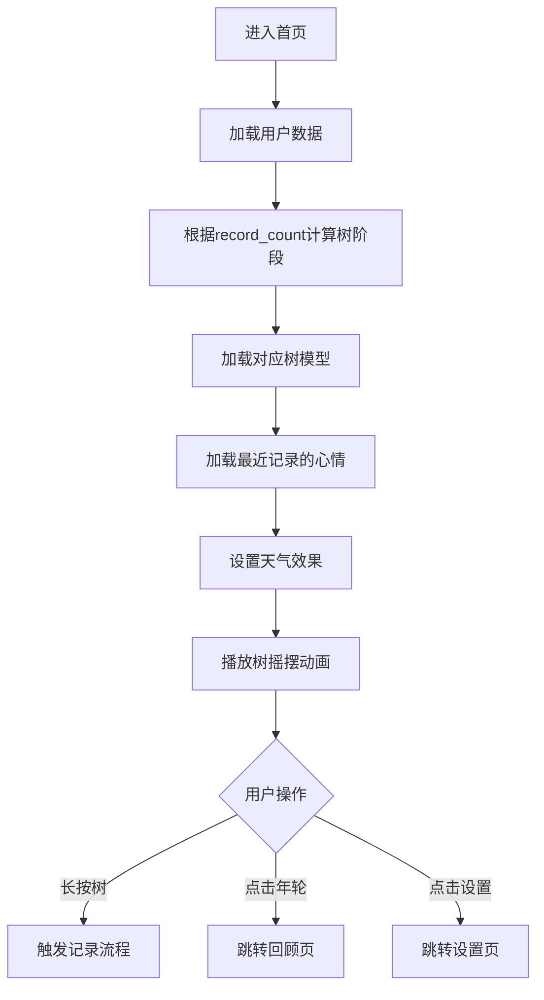

#### 3.3.7 异常/分支流程

| 场景 | 触发条件 | 处理方式 | 提示文案 |
|------|---------|---------|---------|
| 数据加载失败 | 网络异常 | 显示默认树，使用本地缓存数据 | - |
| 首次进入 | 无记录 | 显示种子，提示长按开始 | "Long press the tree for your first record" |

#### 3.3.8 数据字典

无新增，使用用户表数据。

---

### 3.4 记录功能

#### 3.4.1 描述
用户通过长按树触发记录面板，选择心情、输入文字/语音、添加图片，完成一次记录。

#### 3.4.2 用户故事
```
作为 用户，我希望 记录过程简单有趣，以便 愿意坚持记录。
作为 用户，我希望 可以选择心情，以便 让记录更有情感意义。
作为 用户，我希望 可以用语音输入，以便 在不方便打字时也能记录。
作为 用户，我希望 可以上传图片，以便 让记录更丰富。
```

#### 3.4.3 前置条件

| 类型 | 条件 |
|------|------|
| 功能依赖 | 已登录、在首页 |
| 权限依赖 | 需要麦克风权限（语音输入）、相册权限（图片上传） |

#### 3.4.4 后置条件
- 记录保存到Firestore
- 图片保存到Storage
- 用户record_count + 1
- 树成长动画播放
- 天气效果更新

#### 3.4.5 界面及交互

**记录面板布局（从底部弹出）：**
- 顶部拖动条（可拖动关闭）
- 心情选择区：
  - 5个emoji横向排列：😊Happy / 😌Calm / 😢Sad / 😰Anxious / 😤Angry
  - 默认选中"Calm"
- 文字输入区：
  - 多行文本框，占位符"What happened today..."
  - 右下角字数统计 "0/1000"
  - 右上角语音按钮（麦克风图标）
- 图片区：
  - 横向滚动的图片预览区
  - "+" 按钮添加图片（最多4张）
- 底部：
  - 取消按钮（左侧，显示"Cancel"）
  - 保存按钮（右侧，手绘风格主按钮，显示"Save"）

**语音输入界面：**
- 点击语音按钮后弹出
- 中央：大麦克风图标，周围有声波动画
- 提示文字："Listening..."
- 识别到的文字实时显示在上方
- 最长录音60秒
- 自动结束或手动点击停止

**控件说明：**

| 元素 | 类型 | 必填 | 默认值 | 校验规则 | 操作反馈 |
|------|------|------|--------|---------|---------|
| 心情emoji | 单选按钮组 | 是 | 😌 Calm | 必选 | 选中后高亮 |
| 文字输入框 | 多行文本框 | 否 | 空 | 最多1000字 | 超长时截断并提示 |
| 语音按钮 | 按钮 | - | - | - | 点击后请求权限，开始录音 |
| 图片添加 | 按钮 | - | - | 最多4张，每张≤5MB | 超限时提示 |
| 保存按钮 | 按钮 | - | - | 至少有文字或图片 | 点击后loading，成功后关闭面板 |

**心情emoji定义：**

| emoji | 心情名称 | 心情分类 | 天气影响 |
|-------|---------|---------|---------|
| 😊 | 开心 | 正面 | 晴天 |
| 😌 | 平静 | 中性 | 多云 |
| 😢 | 难过 | 负面 | 下雨 |
| 😰 | 焦虑 | 负面 | 大风 |
| 😤 | 愤怒 | 负面 | 雷雨 |

#### 3.4.6 业务流程

```mermaid
flowchart TD
    A[长按树] --> B[树轻轻摆动动效]
    B --> C[记录面板弹出]
    C --> D[默认选中平静]
    D --> E{用户操作}

    E -->|选择心情| F[更新心情选中状态]
    F --> E

    E -->|输入文字| G[文字输入框]
    G --> H[实时显示字数]
    H --> E

    E -->|点击语音| I{有麦克风权限?}
    I -->|是| J[开始录音]
    I -->|否| K[请求权限]
    K -->|用户同意| J
    K -->|用户拒绝| L[提示去设置开启权限]
    J --> M[实时显示识别文字]
    M --> N[录音结束/超时]
    N --> O[文字填入输入框]
    O --> E

    E -->|添加图片| P{有相册权限?}
    P -->|是| Q[打开相册选择器]
    P -->|否| R[请求权限]
    R -->|用户同意| Q
    R -->|用户拒绝| L
    Q --> S[选择图片]
    S --> T{图片数量≤4?}
    T -->|是| U[压缩图片]
    T -->|否| V[提示最多4张]
    U --> W[显示缩略图]
    W --> E

    E -->|点击保存| X{校验}
    X -->|至少有文字或图片| Y[保存到Firebase]
    X -->|内容为空| Z[提示"Write something down..."]
    Z --> E
    Y --> AA[更新record_count]
    AA --> AB[关闭面板]
    AB --> AC[播放树成长动画]
    AC --> AD[更新天气效果]
    AD --> AE[回到首页]
```

#### 3.4.7 异常/分支流程

| 场景 | 触发条件 | 处理方式 | 提示文案 |
|------|---------|---------|---------|
| 内容为空 | 文字和图片都为空 | 禁用保存按钮，提示输入内容 | "Write something down..." |
| 图片过大 | 单张图片 > 5MB | 自动压缩到5MB以下 | - |
| 图片过多 | 已选4张，再选 | 禁用添加按钮 | "Maximum 4 images allowed." |
| 语音识别失败 | 识别返回空 | 提示重试或改用手动输入 | "Couldn't hear clearly. Try again or type." |
| 录音权限被拒 | 用户拒绝授权 | 提示去设置开启 | "Microphone access is required for voice recording." |
| 相册权限被拒 | 用户拒绝授权 | 提示去设置开启 | "Photo access is required to add images." |
| 保存失败 | 网络异常/Firebase错误 | 本地缓存，提示稍后同步 | "Saved locally. Will sync later." |
| 文字超长 | 输入超过1000字 | 自动截断到1000字 | "Content automatically truncated." |

#### 3.4.8 数据字典

**记录表（records）**

| 字段名 | 类型 | 必填 | 说明 | 示例值 |
|--------|------|------|------|--------|
| id | String | 是 | 记录唯一ID（自动生成） | "rec_abc123" |
| user_id | String | 是 | 所属用户ID | "abc123xyz" |
| content | String | 否 | 文字内容（最多1000字） | "今天阳光很好..." |
| mood | String | 是 | 心情类型 | "happy" |
| images | Array<String> | 否 | 图片URL列表（最多4个） | ["https://..."] |
| location | String | 否 | 地点（可选，用户手动添加） | "北京" |
| category | String | 否 | 分类标签（社交/美食等） | "social" |
| created_at | Timestamp | 是 | 创建时间 | 2026-04-28 10:30:00 |
| updated_at | Timestamp | 否 | 更新时间 | 2026-04-28 10:35:00 |

**心情类型枚举（mood）：**

| 值 | 显示名称 | emoji |
|------|---------|-------|
| happy | Happy | 😊 |
| calm | Calm | 😌 |
| sad | Sad | 😢 |
| anxious | Anxious | 😰 |
| angry | Angry |  |

---

### 3.5 树的成长动效

#### 3.5.1 描述
用户完成记录后，树播放成长动画，给用户即时的视觉反馈和成就感。

#### 3.5.2 用户故事
```
作为 用户，我希望 记录后看到树长大的动画，以便 感受到记录带来的成长。
作为 用户，我希望 动画精美治愈，以便 获得愉悦的视觉体验。
```

#### 3.5.3 前置条件

| 类型 | 条件 |
|------|------|
| 功能依赖 | 记录保存成功 |
| 数据依赖 | 用户record_count已更新 |

#### 3.5.4 后置条件
- 动画播放完毕
- 树的状态可能更新（跨越成长阶段时）

#### 3.5.5 界面及交互

**成长动画流程：**
1. 记录面板关闭
2. 树微微发光（光晕效果，0.5秒）
3. 树开始"生长"动画：
   - 如果未跨越阶段：树稍微变大（1.01x），枝叶轻微摇摆
   - 如果跨越阶段：播放完整成长动画（种子→幼苗/幼苗→小树等），持续2-3秒
4. 播放音效（轻柔的"叮"声，可选）
5. 显示Toast："Record saved! The tree grew a little."
6. 天气效果更新（根据心情）

**跨越阶段动画详细描述：**

| 阶段跨越 | 动画描述 | 时长 |
|---------|---------|------|
| 种子→幼苗 | 土壤松动，小芽破土而出，叶子展开 | 2秒 |
| 幼苗→小树 | 树干向上生长，分支出现，树冠形成 | 2.5秒 |
| 小树→中树 | 树干变粗，树冠扩大，颜色加深 | 2.5秒 |
| 中树→大树 | 整体向上生长，树冠变得茂密 | 3秒 |
| 大树→茂盛大树 | 树冠继续扩大，可能出现花朵/果实 | 3秒 |

#### 3.5.6 业务流程

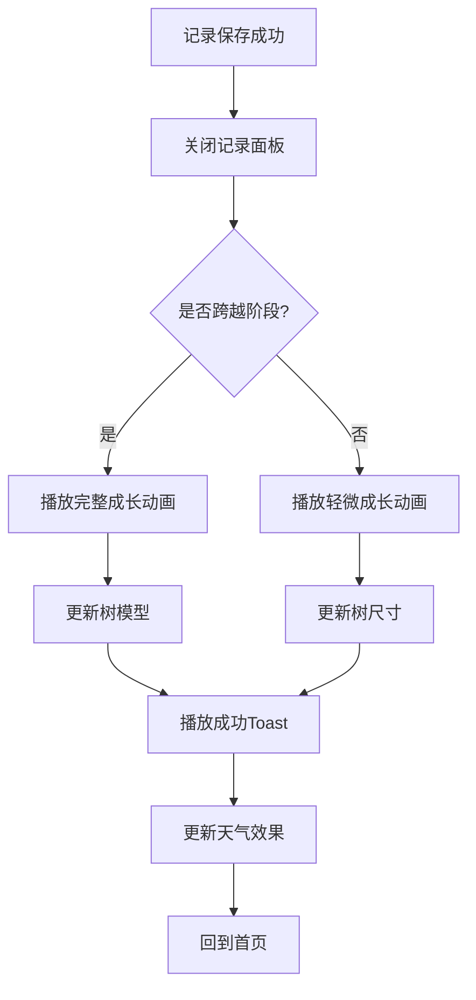

#### 3.5.7 异常/分支流程

| 场景 | 触发条件 | 处理方式 | 提示文案 |
|------|---------|---------|---------|
| 动画加载慢 | 资源未预加载 | 跳过动画，直接更新树状态 | - |

#### 3.5.8 数据字典

无新增，使用用户表数据。

---

### 3.6 树卡片解锁

#### 3.6.1 描述
当用户达到特定里程碑时，解锁一张精美的树卡片，展示树的种类和象征意涵。

#### 3.6.2 用户故事
```
作为 用户，我希望 解锁树卡片时感到惊喜，以便 增强记录的动力。
作为 用户，我希望 了解我的树的种类和象征意涵，以便 与树建立更深的情感连接。
```

#### 3.6.3 前置条件

| 类型 | 条件 |
|------|------|
| 功能依赖 | 记录次数达到里程碑 |
| 数据依赖 | 用户tree_type已分配 |

#### 3.6.4 后置条件
- 卡片展示完毕
- 卡片存入用户的卡片收藏

#### 3.6.5 界面及交互

**卡片解锁弹窗：**
- 背景：半透明遮罩
- 中央：手绘风格卡片
  - 顶部：树的插画（手绘水彩风格）
  - 中部：树的名称（如"橡树"、"樱花树"）
  - 下部：象征意涵文字（如"Oak symbolizes resilience and strength."）
- 底部：收藏按钮 + 分享按钮

**树种定义（示例）：**

| 树种ID | 名称 | 象征意涵 | 解锁条件 |
|--------|------|----------|----------|
| oak_01 | 橡树 | 坚韧、力量、长寿 | 首次记录后随机分配 |
| cherry_01 | 樱花树 | 美丽、短暂、珍惜 | 首次记录后随机分配 |
| pine_01 | 松树 | 坚定、常青、希望 | 首次记录后随机分配 |
| maple_01 | 枫树 | 变化、美丽、回忆 | 首次记录后随机分配 |
| willow_01 | 柳树 | 柔韧、适应、优雅 | 首次记录后随机分配 |

**解锁时机：**
- 首次记录后：解锁树种卡片（随机分配一种）
- 记录达到50次：解锁成长卡片
- 记录达到100次：解锁里程碑卡片

#### 3.6.6 业务流程

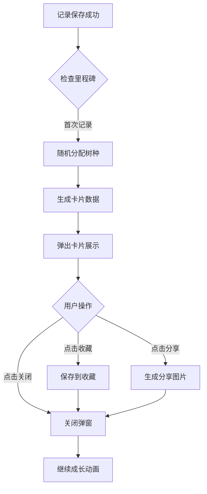

#### 3.6.7 异常/分支流程

| 场景 | 触发条件 | 处理方式 | 提示文案 |
|------|---------|---------|---------|
| 分享失败 | 系统分享功能不可用 | 提示稍后重试 | "Share failed. Please try again later." |

#### 3.6.8 数据字典

**卡片表（cards）**

| 字段名 | 类型 | 必填 | 说明 | 示例值 |
|--------|------|------|------|--------|
| id | String | 是 | 卡片唯一ID | "card_abc123" |
| user_id | String | 是 | 所属用户ID | "abc123xyz" |
| card_type | String | 是 | 卡片类型 | "tree_type" |
| card_data | Object | 是 | 卡片详细数据 | {"name": "橡树", "meaning": "..."} |
| unlocked_at | Timestamp | 是 | 解锁时间 | 2026-04-28 10:30:00 |

---

### 3.7 年轮回顾

#### 3.7.1 描述
用户点击年轮图标进入回顾页面，以年轮造型展示历史记录，支持按分类筛选。

#### 3.7.2 用户故事
```
作为 用户，我希望 以有趣的方式回顾历史记录，以便 感受时间的丰盈。
作为 用户，我希望 可以按分类筛选记录，以便 快速找到想看的内容。
```

#### 3.7.3 前置条件

| 类型 | 条件 |
|------|------|
| 功能依赖 | 已登录、从首页点击年轮图标 |
| 数据依赖 | 有至少1条记录 |

#### 3.7.4 后置条件
- 用户可以查看历史记录详情
- 用户可以删除记录
- 用户可以筛选记录

#### 3.7.5 界面及交互

**年轮页面布局：**
  - 左：返回按钮
  - 中：标题"My Growth Rings"
  - 右：筛选按钮
  - 年轮可视化区域：
    - 以圆心为中心，同心圆代表不同时间段的记录
    - 最内圈：最近的记录
    - 向外扩散：更早的记录
    - 每条记录以小圆点表示，颜色根据心情
  - 点击圆点：弹出该记录预览
  - 分类筛选标签：All | Mood | Location | Social | Food
  - 记录列表（滚动）：点击查看详情

**心情颜色映射：**

| 心情 | 颜色 |
|------|------|
| Happy | 🟡 Yellow |
| Calm | 🟢 Green |
| Sad | 🔵 Blue |
| Anxious | 🟠 Orange |
| Angry | 🔴 Red |

**分类标签定义：**

| 分类 | 筛选条件 | 图标 |
|------|---------|------|
| All | No filter | 📝 |
| Mood | Group by mood type | 😊 |
| Location | Show records with location info | 📍 |
| Social | category = "social" | 👥 |
| Food | category = "food" | 🍜 |

**记录详情页：**
- 中部：
  - 心情emoji
  - 文字内容
  - 图片轮播（如有）
  - 地点（如有）
  - 分类标签（如有）
- 底部：分享按钮

#### 3.7.6 业务流程

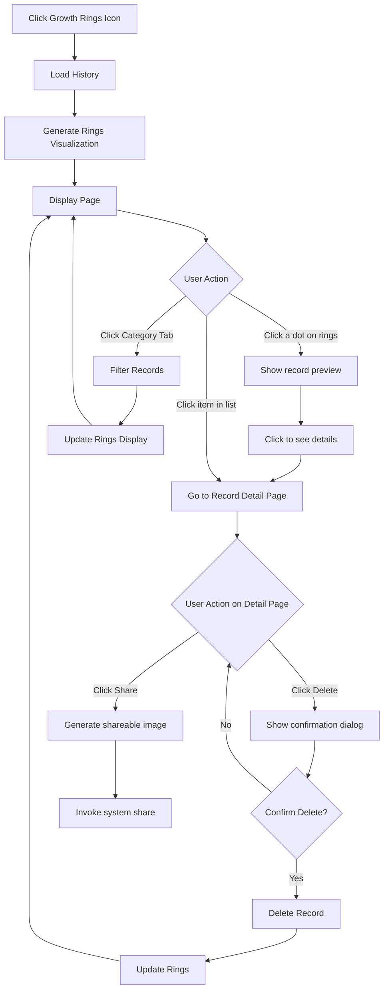

#### 3.7.7 异常/分支流程

| 场景 | 触发条件 | 处理方式 | 提示文案 |
|------|---------|---------|---------|
| 无记录 | record_count = 0 | 显示空状态插画 | "No records yet. Long press the tree to start." |
| 记录加载失败 | 网络异常 | 显示本地缓存，提示稍后同步 | "Loading records..." |
| 删除失败 | 网络异常 | 提示稍后重试 | "Delete failed. Please try again later." |

#### 3.7.8 数据字典

无新增，使用记录表数据。

---

### 3.8 设置

#### 3.8.1 描述
用户点击设置图标进入设置页面，管理个人信息、通知、查看关于信息等。

#### 3.8.2 用户故事
```
作为 用户，我希望 可以查看和修改我的个人信息，以便 保持信息准确。
作为 用户，我希望 可以设置提醒通知，以便 养成记录习惯。
作为 用户，我希望 了解产品信息和支持开发者，以便 更好地使用产品。
```

#### 3.8.3 前置条件

| 类型 | 条件 |
|------|------|
| 功能依赖 | 已登录、从首页点击设置图标 |

#### 3.8.4 后置条件
- 用户可以修改个人信息
- 用户可以设置通知
- 用户可以退出登录

#### 3.8.5 界面及交互

**设置页面布局：**
- 顶部：返回按钮、标题"Settings"
- 列表项：
  - 个人信息：姓名、邮箱
  - 通知提醒：每日提醒开关、提醒时间
  - 关于Plunk：产品介绍、版本号
  - 支持开发者：募捐入口
  - 退出登录（Log Out）

**控件说明：**

| 元素 | 类型 | 必填 | 默认值 | 校验规则 | 操作反馈 |
|------|------|------|--------|---------|---------|
| 每日提醒开关 | 开关 | - | 关闭 | - | 切换后即时保存 |
| 提醒时间 | 时间选择器 | 否 | 21:00 | 开关打开时显示 | 选择后即时保存 |
| 退出登录按钮 | 按钮 | - | - | - | 点击后二次确认 |

#### 3.8.6 业务流程

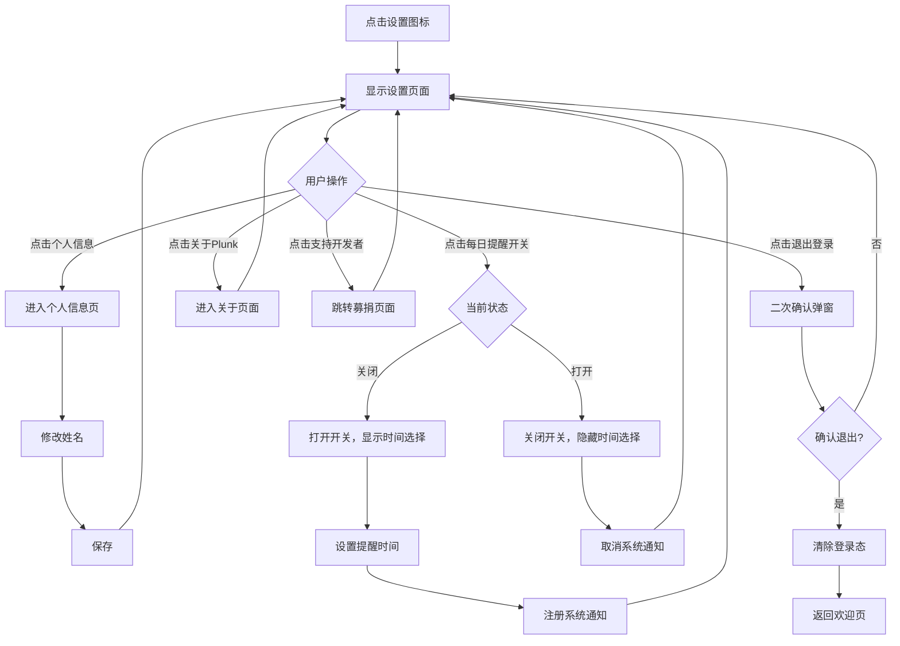

#### 3.8.7 异常/分支流程

| 场景 | 触发条件 | 处理方式 | 提示文案 |
|------|---------|---------|---------|
| 通知权限被拒 | 用户拒绝通知权限 | 提示去设置开启 | "Notification access is required for reminders." |
| 退出登录失败 | 网络异常 | 强制清除本地登录态 | "Logged out successfully." |

#### 3.8.8 数据字典

**用户设置表（user_settings）**

| 字段名 | 类型 | 必填 | 说明 | 示例值 |
|--------|------|------|------|--------|
| user_id | String | 是 | 用户ID | "abc123xyz" |
| daily_reminder | Boolean | 是 | 每日提醒开关 | true |
| reminder_time | String | 否 | 提醒时间（HH:mm） | "21:00" |
| updated_at | Timestamp | 是 | 更新时间 | 2026-04-28 10:00:00 |

---

## 四、非功能需求（注意事项）

### 4.1 安全与合规需求

| 需求 | 说明 |
|------|------|
| 数据传输 | 全部使用HTTPS，Firebase默认支持 |
| 用户认证 | 使用Firebase Auth，邮箱验证码登录 |
| 数据加密 | Firebase自动加密存储 |
| 隐私合规 | 符合Apple App Store审核要求，需提供隐私政策 |
| 数据删除 | 支持用户删除账号和所有数据（GDPR合规） |
| 图片安全 | 上传前检查图片内容，防止非法内容 |
| 最小权限 | 仅请求必要的系统权限（麦克风、相册、通知） |

**隐私政策需包含：**
- 收集的数据类型（姓名、邮箱、记录内容、图片、位置（可选））
- 数据用途（仅用于提供App功能）
- 数据存储位置（Firebase服务器）
- 数据分享政策（不分享给第三方）
- 用户权利（查看、删除数据）

### 4.2 统计需求（埋点）

| 事件名 | 触发时机 | 属性 | 说明 |
|--------|---------|------|------|
| app_open | App启动 | user_id, app_version | 日活统计 |
| page_view | 页面加载完成 | page_name, user_id | 页面访问统计 |
| register_start | 进入注册页 | - | 注册漏斗 |
| register_success | 注册成功 | user_id, method | 注册转化 |
| record_start | 长按树触发记录 | user_id | 记录触发率 |
| record_save | 记录保存成功 | user_id, mood, has_text, has_voice, image_count, duration | 记录行为分析 |
| record_fail | 记录保存失败 | user_id, error_code, error_msg | 异常监控 |
| tree_grow | 树成长动画播放 | user_id, from_stage, to_stage | 成长数据 |
| card_unlock | 卡片解锁 | user_id, card_type | 卡片解锁统计 |
| review_open | 进入年轮页 | user_id | 回顾功能使用率 |
| review_filter | 切换筛选分类 | user_id, category | 筛选行为分析 |
| record_delete | 删除记录 | user_id, record_id | 删除行为 |
| setting_open | 进入设置页 | user_id | 设置使用率 |
| reminder_set | 设置提醒 | user_id, reminder_time | 提醒设置率 |
| donation_click | 点击募捐 | user_id | 募捐转化漏斗 |
| logout | 退出登录 | user_id | 留存分析 |
| error_occur | 异常发生 | user_id, error_code, error_msg, page_name | 异常监控 |

### 4.3 性能需求

| 指标 | 要求 | 说明 |
|------|------|------|
| 冷启动时间 | < 3秒 | 从点击图标到首页可见 |
| 热启动时间 | < 1秒 | App在后台时切回前台 |
| 页面加载 | < 1秒 | 页面切换动画流畅 |
| 记录保存 | < 2秒 | 含图片上传 |
| 图片加载 | < 1秒（缩略图） | 使用CDN加速 |
| 动画帧率 | ≥ 30fps | 树摇摆、成长动画 |
| 年轮渲染 | < 2秒 | 100条记录以内 |
| 离线支持 | 支持 | 本地缓存记录，网络恢复后同步 |
| 内存占用 | < 200MB | iOS设备内存限制 |
| 安装包大小 | < 100MB | iOS App Store推荐 |

### 4.4 数据库设计

**Firestore 集合结构：**

```
/users/{userId}
  - id: String
  - name: String
  - email: String
  - created_at: Timestamp
  - record_count: Number
  - tree_stage: String
  - tree_type: String

/records/{recordId}
  - id: String
  - user_id: String
  - content: String
  - mood: String
  - images: Array<String>
  - location: String
  - category: String
  - created_at: Timestamp
  - updated_at: Timestamp

/cards/{cardId}
  - id: String
  - user_id: String
  - card_type: String
  - card_data: Object
  - unlocked_at: Timestamp

/user_settings/{userId}
  - user_id: String
  - daily_reminder: Boolean
  - reminder_time: String
  - updated_at: Timestamp
```

**索引策略：**
- records集合：按user_id + created_at建立复合索引（用于年轮查询）
- records集合：按user_id + mood建立复合索引（用于心情筛选）

**数据生命周期：**
- 用户数据：账号删除时清除
- 记录数据：用户删除时清除
- 图片数据：记录删除时清除
- 本地缓存：用户可手动清除

### 4.5 系统集成

| 对接系统 | 接口方向 | 协议 | 说明 |
|---------|---------|------|------|
| Firebase Auth | 调用 | Firebase SDK | 用户认证 |
| Firestore | 调用 | Firebase SDK | 数据存储 |
| Firebase Storage | 调用 | Firebase SDK | 图片存储 |
| Firebase Analytics | 调用 | Firebase SDK | 埋点统计 |
| iOS系统通知 | 调用 | iOS Native API | 每日提醒 |
| iOS语音识别 | 调用 | iOS Native API | 语音转文字 |
| iOS相册 | 调用 | iOS Native API | 图片选择 |
| iOS分享 | 调用 | iOS Native API | 分享功能 |

**第三方服务：**

| 服务 | 用途 | 成本 |
|------|------|------|
| Firebase Spark计划 | 认证、数据库、存储、分析 | 免费 |
| Unity Personal | 游戏引擎 | 免费 |
| 募捐平台（如爱发电） | 用户募捐 | 抽成 |

---

## 五、附录（补充文档）

### 5.1 验收标准与测试要点

| 功能 | 验收条件 | 优先级 |
|------|---------|--------|
| 欢迎页 | 打开App显示欢迎页，点击"开始"跳转注册页 | P0 |
| 注册-正常流程 | 输入姓名+邮箱→发送验证码→输入验证码→注册成功→进入首页 | P0 |
| 注册-验证码错误 | 输入错误验证码，提示"验证码错误" | P0 |
| 注册-邮箱已存在 | 输入已注册邮箱，提示"该邮箱已注册" | P0 |
| 注册-网络异常 | 断网情况下，提示"网络开小差了" | P1 |
| 首页-树展示 | 首页显示树，树摇摆动画流畅 | P0 |
| 首页-天气效果 | 根据最近记录心情显示对应天气效果 | P0 |
| 记录-文字 | 长按树→输入文字→保存成功→树成长动画播放 | P0 |
| 记录-语音 | 点击语音按钮→说话→识别成功→文字填入输入框 | P1 |
| 记录-图片 | 添加图片→显示缩略图→保存成功→图片可查看 | P1 |
| 记录-内容为空 | 无文字无图片时，保存按钮禁用 | P0 |
| 记录-文字超长 | 输入超过1000字，自动截断 | P1 |
| 记录-图片过多 | 选择超过4张图片，提示"最多4张" | P1 |
| 记录-图片过大 | 选择超过5MB图片，自动压缩 | P1 |
| 树成长-跨阶段 | 记录次数达到阈值，播放完整成长动画 | P0 |
| 树成长-未跨阶段 | 记录后树轻微变大 | P0 |
| 树卡片-解锁 | 首次记录后弹出卡片，可收藏/分享 | P2 |
| 年轮-展示 | 点击年轮图标，显示年轮可视化 | P0 |
| 年轮-筛选 | 点击分类标签，年轮和列表更新 | P1 |
| 年轮-空状态 | 无记录时显示"还没有记录" | P0 |
| 记录详情-查看 | 点击记录，显示完整内容 | P0 |
| 记录详情-删除 | 点击删除→确认→记录删除成功 | P2 |
| 设置-个人信息 | 显示姓名和邮箱 | P1 |
| 设置-通知 | 开启每日提醒，到时间收到通知 | P2 |
| 设置-退出登录 | 点击退出→确认→返回欢迎页 | P0 |
| 离线支持 | 断网时记录保存到本地，联网后同步 | P1 |
| 性能-启动时间 | 冷启动 < 3秒 | P1 |
| 性能-动画流畅 | 动画帧率 ≥ 30fps | P1 |

### 5.2 待确认项清单

#### 必须确认（阻塞开发）
1. **[假设]** 心情emoji固定为5种（😊😌😢😰😤），是否需要更多或可自定义？
2. **[假设]** 语音识别使用iOS原生API，是否需要支持实时语音识别？
3. **[假设]** 图片压缩使用Unity自带功能，是否需要引入第三方库？
4. **[假设]** 年轮展示每条记录为圆点，是否需要显示更多信息（如日期）？
5. **[假设]** 树的3D模型使用Unity Asset Store资源，是否需要定制？

#### 建议确认（影响完整度）
6. **[待确认]** 树的种类是否需要更多？（当前定义5种）
7. **[待确认]** 地点信息是用户手动输入还是自动获取？
8. **[待确认]** 分类标签（社交/美食）是用户手动选择还是AI自动识别？
9. **[待确认]** 卡片分享是否需要添加水印？
10. **[待确认]** 募捐平台使用哪个？（爱发电、Buy Me a Coffee等）

#### 可后续补充
11. **[待确认]** 是否需要支持深色模式？
12. **[待确认]** 初始版本已全面使用英语，是否需要支持多语言（如补充中文）？
13. **[待确认]** 是否需要支持iPad适配？
14. **[待确认]** 是否需要Widget功能？
15. **[待确认]** 是否需要Apple Watch配套应用？

### 5.3 开发里程碑

| 阶段 | 时间 | 任务 | 交付物 |
|------|------|------|--------|
| 准备期 | 4月底 | 环境搭建、技术验证 | Unity项目、Firebase配置 |
| 开发期1 | 5月1-10日 | 注册登录、首页树展示 | 可运行的App原型 |
| 开发期2 | 5月11-20日 | 记录功能、树成长动效 | 核心功能可用 |
| 开发期3 | 5月21-31日 | 年轮回顾、设置、卡片 | 功能完整 |
| 测试期 | 6月1-10日 | 测试、Bug修复、优化 | 稳定版本 |
| 上架期 | 6月11-20日 | App Store提交审核 | 审核中 |
| 发布期 | 6月下旬 | 审核通过、正式上架 | App Store可下载 |

### 5.4 风险与应对

| 风险 | 影响 | 概率 | 应对措施 |
|------|------|------|----------|
| Unity学习曲线陡峭 | 开发延期 | 中 | 优先使用Asset Store资源，减少从零开发 |
| Firebase免费额度用尽 | 功能受限 | 低 | 监控使用量，设置预警；准备付费方案 |
| App Store审核被拒 | 上架延期 | 中 | 提前了解审核规范，准备隐私政策 |
| 动效性能问题 | 用户体验差 | 中 | 使用2D替代3D，优化资源大小 |
| 语音识别准确率低 | 功能体验差 | 低 | 提供文字输入兜底，优化识别逻辑 |
| 单人开发精力不足 | 功能削减 | 高 | 优先完成P0功能，P1/P2可后续迭代 |

---

**文档结束**

*Plunk PRD V1.0.0*
*编写日期：2026年4月28日*
